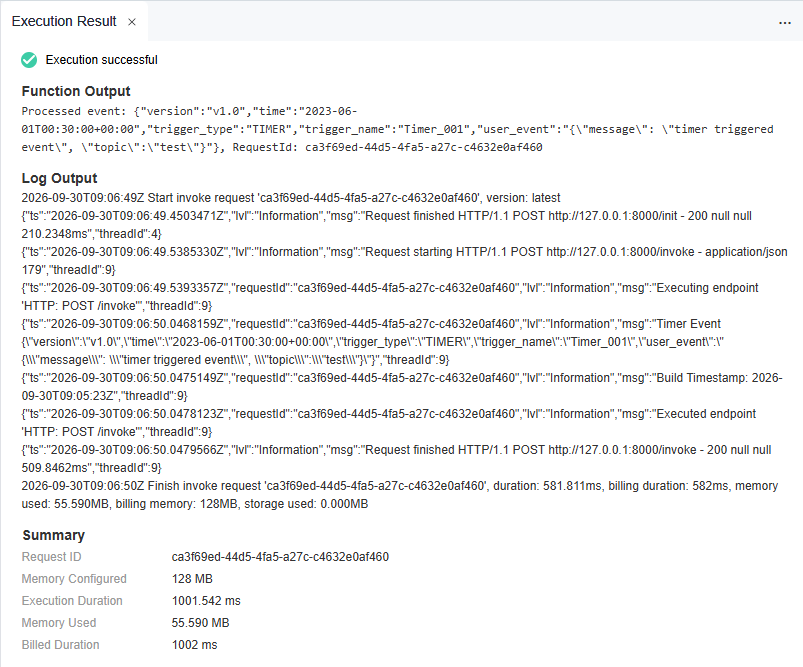

.. _creating_an_event_function_using_a_container_image_built:

Creating an Event Function using a container image built with C#
======================================================================

.. toctree::
   :maxdepth: 1
   :hidden:

For general details about how to use a container image
to create and execute an event function,
see :otc_fg_umn:`Creating an Event Function Using a Container Image and executing the Function <getting_started/creating_an_event_function_using_a_container_image_and_executing_the_function.html>`.

This chapter introduces how to create an image using C#
and perform local verification for event functions.

.. note::

  You need to implement an **HTTP server** in the image listening to port **8000** to receive requests.

  Following request path is required:

  * **POST /invoke** is the function **execution** entry where trigger events are processed.

  Following request path is optional:

  * **POST /init** is the function **initialization** entry where you can perform
    initialization operations such as loading dependencies and preparing runtime environment.
    This entry is optional, and you can choose to implement it based on your needs.
    If you do not implement this entry, FunctionGraph will directly execute the function
    without initialization.

Step 1: Create the Project
--------------------------------------------

See: :github_repo_master:`Container Event Timer Sample <samples-doc/container-event-timer>`
for an example of creating an event function using a container image built with C#.

Step 2: Build the Container Image
--------------------------------------------

Build and verify the image locally
^^^^^^^^^^^^^^^^^^^^^^^^^^^^^^^^^^^^^^^^^^^^^^^^

**1. Build the image**

Build the image either using **docker build** or the Makefile target **docker_build**:

.. tabs::

  .. tab:: using docker build
      Run the following command in the project root folder to build the image:

      .. code-block:: shell

         docker buildx build \
            --platform linux/amd64 \
            --file Dockerfile \
            --tag custom_container_event_timer_csharp:latest .

  .. tab:: using Makefile target "docker_build"
      Run the following command in the project root folder to build the image:

      .. code-block:: shell

          make docker_build

**2. Run the image locally**

Run the image either using **docker run** or the Makefile target **docker_run_local**:

.. tabs::

  .. tab:: using docker run
      Run the following command in the project root folder to run the image:

      .. code-block:: shell

         docker container run --rm \
           --platform linux/amd64 \
           --publish 8000:8000 \
           --name custom_container_event_timer_csharp \
           custom_container_event_timer_csharp:latest

  .. tab:: using Makefile target "docker_run_local"

      Run the following command in the project root folder to run the image:

      .. code-block:: shell

         make docker_run_local

**3. Test the image locally**

Test the image using the Makefile target **test_local** - run the following command in a new terminal to test the image:

   .. code-block:: shell

      make test_local

You should see output similar to the following:

.. code-block:: text

   Processed event: {"version":"v1.0","time":"2023-06-01T00:30:00+00:00","trigger_type":"TIMER","trigger_name":"Timer_001","user_event":"{\"message\": \"timer triggered event\", \"topic\":\"test\"}"}, RequestId: e1817952-1c91-4779-adaf-459804910e30

Step 3: Upload the Container Image to SWR (SoftWare Repository for Container)
-----------------------------------------------------------------------------

For details on SWR (SoftWare Repository for Container), see:

* :docs_otc:`Software Repository for Container User Manual <software-repository-container/umn/>`
* :docs_otc:`Uploading an Image through a Container Engine Client <software-repository-container/umn/image_management/uploading_an_image_through_a_container_engine_client.html>`
* :docs_otc:`Obtaining a Long-Term Docker Login Command <software-repository-container/umn/image_management/obtaining_a_long-term_docker_login_command.html>`

Prerequisites
^^^^^^^^^^^^^^^^^^^^^^^^^^^^^^^^^^^^^^^^^^^^^^^^

* SWR instance created.
* Credentials for SWR created.  

Upload the image to SWR
^^^^^^^^^^^^^^^^^^^^^^^^^^^^^^^^^^^^^^^^^^^^^^^^

To upload the container image to SWR, following values are needed:

.. list-table::
   :header-rows: 1
   :widths: 20 80

   * - Parameter
     - Description
   * - OTC_SDK_PROJECTNAME
     - | Your project name.
       | To obtain this, see: :api_usage:`Obtaining a Project ID<guidelines/calling_apis/obtaining_required_information.html>`
         in API usage guide but use the **project name** instead of the project ID.
   * - OTC_SDK_AK
     - Your Access Key
   * - OTC_SWR_LOGIN_KEY
     - | The login key for SWR.
       | For details see: :docs_otc:`Obtaining a Long-Term Docker Login Command <software-repository-container/umn/image_management/obtaining_a_long-term_docker_login_command.html>`
         in the Software Repository for Container user manual.
       |
       | It can be generated using the access key **${OTC_SDK_AK}** and secret key **${OTC_SDK_SK}** as follows:

        .. code-block:: shell

          export OTC_SWR_LOGIN_KEY=$(printf "${OTC_SDK_AK}" | \
                  openssl dgst -binary -sha256 -hmac "${OTC_SDK_SK}" | \
                  od -An -vtx1 | sed 's/[ \n]//g' | sed 'N;s/\n//')

   * - OTC_SWR_ENDPOINT
     - SWR endpoint, e.g. **swr.eu-de.otc.t-systems.com**
   * - OTC_SWR_ORGANIZATION
     - Your SWR organization name
   * - IMAGE_NAME
     - The name of your container image

Set the environment variables:
  .. code-block:: shell

      export OTC_SDK_PROJECTNAME=<your_project_name>
      export OTC_SDK_AK=<your_access_key>
      export OTC_SDK_SK=<your_secret_key>
      export OTC_SWR_LOGIN_KEY=$(printf "${OTC_SDK_AK}" | \
              openssl dgst -binary -sha256 -hmac "${OTC_SDK_SK}" | \
              od -An -vtx1 | sed 's/[ \n]//g' | sed 'N;s/\n//')
      export OTC_SWR_ENDPOINT=swr.eu-de.otc.t-systems.com
      export OTC_SWR_ORGANIZATION=<your_swr_organization>
      export IMAGE_NAME=custom_container_event_example

Upload the image to SWR either using **shell commands** or the Makefile target **docker_push**:

.. tabs::

   .. tab:: Pushing using shell commands
        Run the following commands in the **container-event-timer** folder to upload the image to SWR:

        .. code-block:: shell
          :caption: **1. Login to SWR**

            docker login -u ${OTC_SDK_PROJECTNAME}@${OTC_SDK_AK} -p ${OTC_SWR_LOGIN_KEY} ${OTC_SWR_ENDPOINT}

        .. code-block:: shell
          :caption: **2. Tag the image**

            docker tag ${IMAGE_NAME}:latest ${OTC_SWR_ENDPOINT}/${OTC_SWR_ORGANIZATION}/${IMAGE_NAME}:latest

        .. code-block:: shell
          :caption: **3. Push the image to SWR**

            docker push ${OTC_SWR_ENDPOINT}/${OTC_SWR_ORGANIZATION}/${IMAGE_NAME}:latest

   .. tab:: using Makefile target "docker_push"
        Run the following command in the **container-event-timer** folder to upload the image to SWR:

       .. code-block:: shell

          make docker_push

Step 4: Terraform Deployment
-----------------------------------------------------------------------------

For the configuration needed for Terraform deployment, see :ref:`ref_terraform_setup`.

To deploy the function (including a test event) using Terraform adapt the MakefileTF and
the Terraform configuration files in the sample folder according to your needs
and execute the following commands in the project root folder:

.. code-block:: bash

   make -f MakefileTF tf_apply

To update code changes use:

.. code-block:: bash

   make -f MakefileTF update_image

.. note::
   To clean up the resources created by Terraform, execute the following command in the project root folder:
   
   .. code-block:: bash
     
      make -f MakefileTF tf_destroy

Step 5: View the Execution Result
---------------------------------

Click **Test** and view the execution result on the right.

You should see output similar to the following:

The execution result contains the following sections:

* The **Function Output** section displays the function's return value.

* The **Log Output** section displays the logs generated during function execution.

  .. note::
     This page displays a maximum of 2K logs.

* The **Summary** section displays key information from the **Log**.
